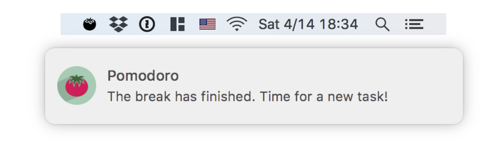

# Pomodoro

**Pomodoro** is a minimal macOS menu bar app written in Swift 4 one fine
Saturday morning. Other pomodoro apps do too much, don't look good, or have ads.
Pomodoro does exactly what it needs to do, looks ok, and doesn't have ads.

Pomodoro doesn't show an ongoing timer. When a task or a break is over it sends
a local notification.

## Download

Download Pomodoro from the [releases][dl-link] page.

## License

MIT. Icons used available [here][icon1] and [here][icon2].

[icon1]:
    http://www.iconarchive.com/show/food-drink-icons-by-graphicloads/tomato-icon.html

[icon2]:
    https://icons8.com/icon/1810/tomato

[dl-link]:
    https://github.com/apas/pomodoro/releases
